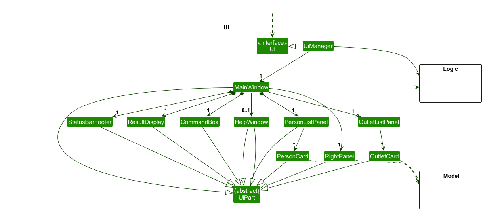
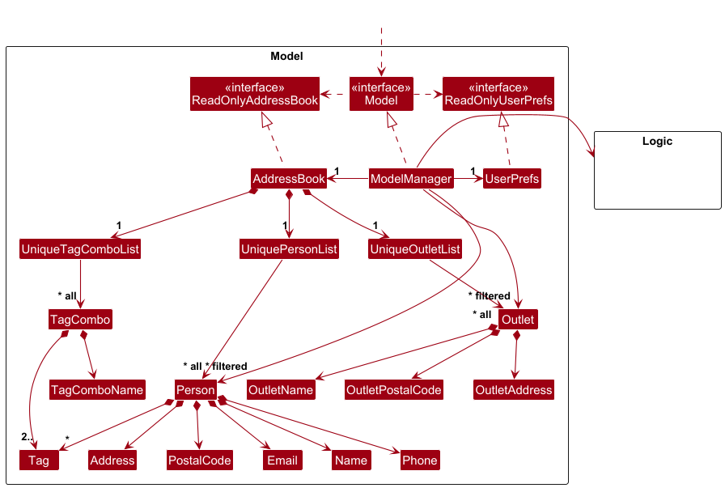
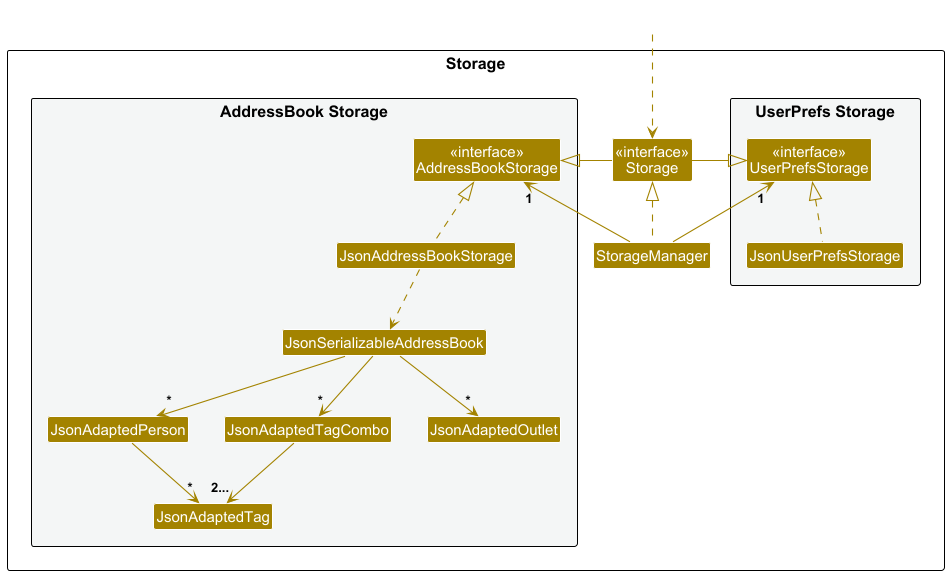
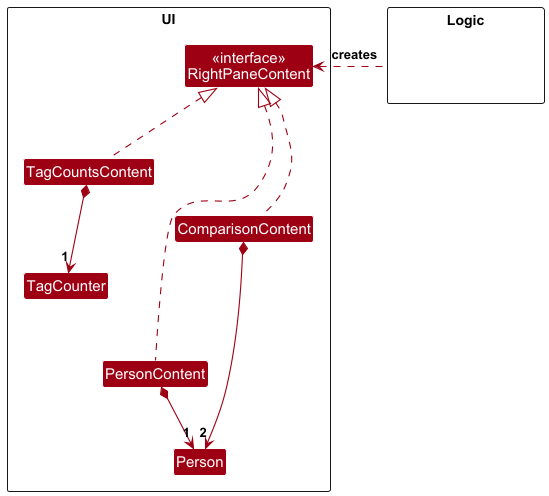
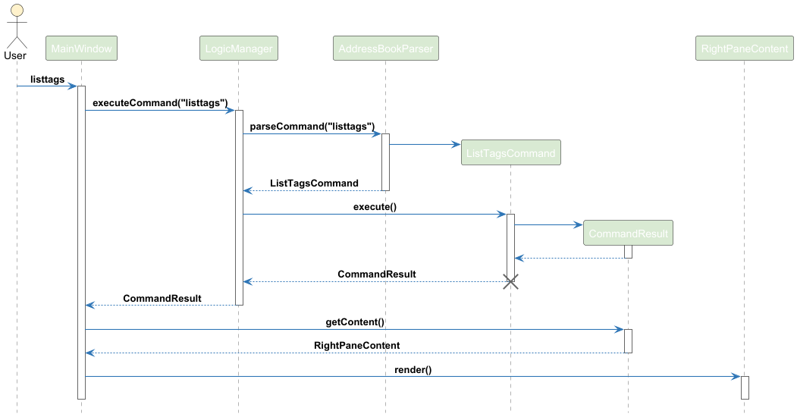
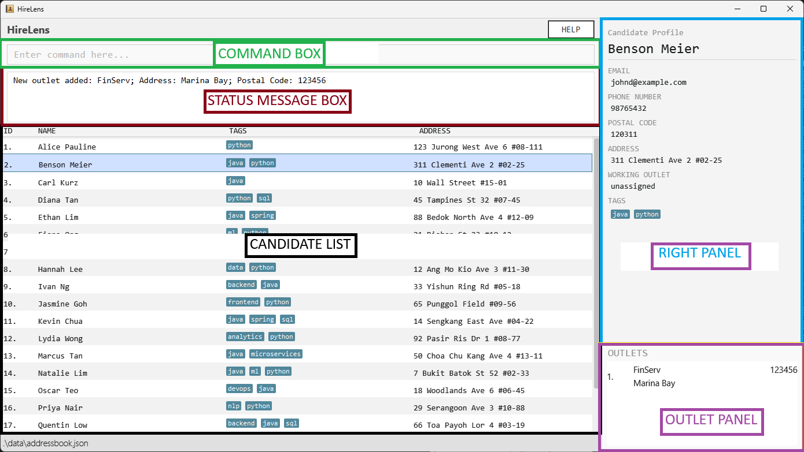

* Table of Contents
{:toc}

--------------------------------------------------------------------------------------------------------------------

## **Acknowledgements**

--------------------------------------------------------------------------------------------------------------------

## **Setting up, getting started**

Refer to the guide [_Setting up and getting started_](SettingUp.md).

--------------------------------------------------------------------------------------------------------------------

## **Design**

:bulb: **Tip:** The `.puml` files used to create diagrams are in this document `docs/diagrams` folder. Refer to the [_PlantUML Tutorial_ at se-edu/guides](https://se-education.org/guides/tutorials/plantUml.html) to learn how to create and edit diagrams.

### Architecture

The ***Architecture Diagram*** given above explains the high-level design of the App.

Given below is a quick overview of main components and how they interact with each other.

**Main components of the architecture**

**`Main`** (consisting of classes [`Main`](https://github.com/AY2526S2-CS2103-F08-3/tp/blob/master/src/main/java/seedu/address/Main.java) and [`MainApp`](https://github.com/AY2526S2-CS2103-F08-3/tp/blob/master/src/main/java/seedu/address/MainApp.java)) is in charge of the app launch and shut down.
* At app launch, it initializes the other components in the correct sequence, and connects them up with each other.
* At shut down, it shuts down the other components and invokes cleanup methods where necessary.

The bulk of the app's work is done by the following four components:

* [**`UI`**](#ui-component): The UI of the App.
* [**`Logic`**](#logic-component): The command executor.
* [**`Model`**](#model-component): Holds the data of the App in memory.
* [**`Storage`**](#storage-component): Reads data from, and writes data to, the hard disk.

[**`Commons`**](#common-classes) represents a collection of classes used by multiple other components.

**How the architecture components interact with each other**

The *Sequence Diagram* below shows how the components interact with each other for the scenario where the user issues the command `delete 1`.

Each of the four main components (also shown in the diagram above),

* defines its *API* in an `interface` with the same name as the Component.
* implements its functionality using a concrete `{Component Name}Manager` class (which follows the corresponding API `interface` mentioned in the previous point.

For example, the `Logic` component defines its API in the `Logic.java` interface and implements its functionality using the `LogicManager.java` class which follows the `Logic` interface. Other components interact with a given component through its interface rather than the concrete class (reason: to prevent outside component's being coupled to the implementation of a component), as illustrated in the (partial) class diagram below.

The sections below give more details of each component.

### UI component

The **API** of this component is specified in [`Ui.java`](https://github.com/AY2526S2-CS2103-F08-3/tp/blob/master/src/main/java/seedu/address/ui/Ui.java)

The UI consists of a `MainWindow` that is made up of parts e.g.`CommandBox`, `ResultDisplay`, `PersonListPanel`, `StatusBarFooter` etc. All these, including the `MainWindow`, inherit from the abstract `UiPart` class which captures the commonalities between classes that represent parts of the visible GUI.

The `UI` component uses the JavaFx UI framework. The layout of these UI parts are defined in matching `.fxml` files that are in the `src/main/resources/view` folder. For example, the layout of the [`MainWindow`](https://github.com/AY2526S2-CS2103-F08-3/tp/blob/master/src/main/java/seedu/address/ui/MainWindow.java) is specified in [`MainWindow.fxml`](https://github.com/AY2526S2-CS2103-F08-3/tp/blob/master/src/main/resources/view/MainWindow.fxml)

The `UI` component,

* executes user commands using the `Logic` component.
* listens for changes to `Model` data so that the UI can be updated with the modified data.
* keeps a reference to the `Logic` component, because the `UI` relies on the `Logic` to execute commands.
* depends on some classes in the `Model` component, as it displays `Person` and `Outlet` object residing in the `Model`.

### Logic component

**API** : [`Logic.java`](https://github.com/AY2526S2-CS2103-F08-3/tp/blob/master/src/main/java/seedu/address/logic/Logic.java)

Here's a (partial) class diagram of the `Logic` component:

The sequence diagram below illustrates the interactions within the `Logic` component, taking `execute("delete 1")` API call as an example.

:information_source: **Note:** The lifeline for `DeleteCommandParser` should end at the destroy marker (X) but due to a limitation of PlantUML, the lifeline continues till the end of diagram.

How the `Logic` component works:

1. When `Logic` is called upon to execute a command, it is passed to an `AddressBookParser` object which in turn creates a parser that matches the command (e.g., `DeleteCommandParser`) and uses it to parse the command.
1. This results in a `Command` object (more precisely, an object of one of its subclasses e.g., `DeleteCommand`) which is executed by the `LogicManager`.
1. The command can communicate with the `Model` when it is executed (e.g. to delete a candidate). 
   Note that although this is shown as a single step in the diagram above (for simplicity), in the code it can take several interactions (between the command object and the `Model`) to achieve.
1. The result of the command execution is encapsulated as a `CommandResult` object which is returned back from `Logic`.

Here are the other classes in `Logic` (omitted from the class diagram above) that are used for parsing a user command:

How the parsing works:
* When called upon to parse a user command, the `AddressBookParser` class creates an `XYZCommandParser` (`XYZ` is a placeholder for the specific command name e.g., `AddCommandParser`) which uses the other classes shown above to parse the user command and create a `XYZCommand` object (e.g., `AddCommand`) which the `AddressBookParser` returns back as a `Command` object.
* All `XYZCommandParser` classes (e.g., `AddCommandParser`, `DeleteCommandParser`, ...) inherit from the `Parser` interface so that they can be treated similarly where possible e.g, during testing.

### Model component
**API** : [`Model.java`](https://github.com/AY2526S2-CS2103-F08-3/tp/blob/master/src/main/java/seedu/address/model/Model.java)

The `Model` component,

* stores the address book data i.e., all `Person` objects (which are contained in a `UniquePersonList` object), all `Outlet` objects (which are contained in a `UniqueOutletList` object) and all `TagCombo` objects (which are contained in a `UniqueTagComboList` object).
* stores the currently 'selected' `Person` objects (e.g., results of a search query) as a separate _filtered_ list which is exposed to outsiders as an unmodifiable `ObservableList<Person>` that can be 'observed' e.g. the UI can be bound to this list so that the UI automatically updates when the data in the list change. The same applies for `Outlet` objects, but not `TagCombo` objects.
* stores a `UserPref` object that represents the user’s preferences. This is exposed to the outside as a `ReadOnlyUserPref` objects.
* depends on the `Logic` component as they store commands in a stack to implement the redo/undo functionality.

### Storage component

**API** : [`Storage.java`](https://github.com/AY2526S2-CS2103-F08-3/tp/blob/master/src/main/java/seedu/address/storage/Storage.java)

The `Storage` component,
* can save both address book data and user preference data in JSON format, and read them back into corresponding objects.
* inherits from both `AddressBookStorage` and `UserPrefStorage`, which means it can be treated as either one (if only the functionality of only one is needed).
* depends on some classes in the `Model` component (because the `Storage` component's job is to save/retrieve objects that belong to the `Model`)

### Common classes

Classes used by multiple components are in the `seedu.address.commons` package.

--------------------------------------------------------------------------------------------------------------------

## **Implementation**

This section describes some noteworthy details on how certain features are implemented.

### Right Panel Content

The right panel is used by several different commands, such as `listtags`, `add`, `delete`, `listtagcombos`, `compare` etc. The different kinds of details that can be displayed on the right panel are full details of a `Person`, the frequency of `Tag`s, and the `TagCombo` list, comparison of 2 different `Person`s.

#### Implementation

To implement this, a common interface, `RightPaneContent`, defines an abstract render() method, which encapsulates the logic required to display a specific type of content. Concrete implementations of this interface correspond to different view types, such as displaying a `Person` or `Tag` frequency information.

When a command is executed, the `Logic` component determines the appropriate content to display and instantiates the corresponding `RightPaneContent` implementation. The UI then invokes the render() method polymorphically, without needing to know the specific type of content being displayed.

This design eliminates the need for conditional logic in the UI to handle multiple content types, improving extensibility and maintainability. New display types can be introduced by adding new implementations of `RightPaneContent` without modifying existing code.

The UML diagram for the design is shown below.

An example sequence diagram when the command `listtags` is called is shown below.

1. The user enters `listtags` in the UI.
2. `MainWindow` passes the command to `LogicManager` via `executeCommand("listtags")`.
3. `LogicManager` forwards the request to `AddressBookParser`, which parses the input and creates a `ListTagsCommand`.
4. `LogicManager` executes the `ListTagsCommand`.
5. The command creates a `CommandResult` during execution and returns it to `LogicManager`, which propagates it back to `MainWindow`.
6. `MainWindow` retrieves the `RightPaneContent` from the `CommandResult` using `getContent()`.
7. `MainWindow` calls `render()` on the `RightPaneContent` to update the UI.

### Help Function That Displays The User Guide

#### Implementation

The proposed Help Function is implemented via a Help Window that displays the raw `UserGuide.md` to the user, to be extended as a rendered HTML in the future. It is implemented across the classes `HelpWindow` and `UserGuideParser`.

`UserGuideParser.extractUserGuide()` handles the logic of reading and extracting text. It accepts a `BufferedReader` and two heading strings, a start heading and an end heading which are used to delineate between the start of the text to be rendered and the end. The lines between them are returned as a single string. If the start heading is not found, it throws an `IOException`.

`HelpWindow.loadUserGuide()` handles the file I/O. It opens `UserGuide.md` via a `BufferedReader` inside a `try` block, ensuring the file handle remains closed no matter if an exception occurs. It passes the `BufferedReader` object to `UserGuideParser.extractUserGuide()` and returns the result.

This separated design was made to make the function's internal logic easier to test.

Manual testing would involve changing the contents, location and possibly format of the user guide, but it is only designed to handle correct .md files.

### Compare Command

#### Implementation

In order to allow the user to view two Candidates' information at the same time to compare them, the user inputs a command of the form: `compare INDEX_1 INDEX 2`, for instance, `compare 1 2`. The indices are one-based indices corresponding to the indices of any entry currently shown in the current candidate list.

The user's input calls `execute("command 1 2")` of the `LogicManager` where the input signature is `compare 1 2`, as a `String`.

It then calls `parseCommand("compare 1 2")` of the `AddressBookParser`, which extracts the word "compare", and passes the subsequent argument string " 1 2" to `CompareCommandParser`, which is-a child class of `Parser` that provides an overridden `parse(String: s)` method whose function is simply to use the regex to ensure that the indexes are of the correct format, i.e. they must have the relevant spaces and must have two positive integers. If the pattern is not exactly matched, e.g. if noninteger, zero or negative values are encountered, then a `ParseException` is safely thrown and no command object is created (although `CompareCommand`'s error message is used to show to the user.)

If the initial input format checks are passed, then a `CompareCommand` object is created and `CompareCommand.execute()` is run and the result returned to the `MainWindow`, from which the `execute(Model: m)` method is called in `CompareCommand`.

`CompareCommand.execute(Model: m)` then checks whether the indexes are the same, whether the indexes are within the size of the current `personlist`, and throwing the relevant errors into the user's Status Message Panel if so, by using `getFilteredPersonList()` of `Model` to obtain the `lastShownList` to check against.

Finally it uses these indexes to call the first `Person` and `Header` and second `Person` and `Header`, from the `filteredPersonList` in order to create the `Content` object `ComparisonContent` (which is-a `RightPaneContent` child class) as the `result` for display in the right panel. This returns the relevant `CommandResult` to be displayed as the final return of `executeCommand()`.

The `CompareCommand`'s `CommandResult` is only cleared when other functions act on the model to display a new `CommandResult`, and it does not itself act on the model to change it, so it is safe.

`CompareCommand` was also not designed to inherit `UndoCommand` since it only retrieves from the model, rather than inducing a potentially permanent change to the display that a careless user may need to `undo`.

The class and sequence diagrams of the feature is as follows:

--------------------------------------------------------------------------------------------------------------------

## **Documentation, logging, testing, configuration, dev-ops**

* [Documentation guide](Documentation.md)
* [Testing guide](Testing.md)
* [Logging guide](Logging.md)
* [Configuration guide](Configuration.md)
* [DevOps guide](DevOps.md)

--------------------------------------------------------------------------------------------------------------------

## **Appendix: Requirements**

### Product scope

**Target user profile**:

* Designed for HR recruiters
* Prefer desktop apps over other types
* Is reasonably comfortable using CLI apps
* Wants to enter candidates’ credentials quickly, which could be extremely large
* Wants to filter and compare candidates by qualifications, distances to workplaces etc
* Wants to use the program to speed up their other workflows, e.g. writing emails

**Value proposition**:
* Fast and easy search/filter that can check different fields such as salary, qualifications, positions and more.
* Pin certain entries for fast comparison or easy access.
* Take an input of a .csv file with the correct format and with relevant data and automatically add the candidates to the list.
* Quickly filter through the candidates for those with the ideal skills (and any other factors).
* Assign candidates to offices quickly.

### User stories

Priorities: High (must have) - `* * *`, Medium (nice to have) - `* *`, Low (unlikely to have) - `*`

| Priority | As a …​                                             | I want to …​                                                                           | So that I can…​                                                     |
|----------|-----------------------------------------------------|----------------------------------------------------------------------------------------|---------------------------------------------------------------------|
| `* * *`  | new recruiter                                       | be able to request a help menu pop-up                                                  | know which commands to use when unfamiliar with the app             |
| `* * *`  | recruiter                                           | add candidates with their names, phone numbers, email addresses                        | easily contact them for future job openings                         |
| `* * *`  | recruiter                                           | be able to edit candidates                                                             | fix any minor mistakes I make                                       |
| `* * *`  | recruiter                                           | be able to delete candidates                                                             | un-track candidates I am no longer interested in                    |
| `* * *`  | recruiter                                           | be able to filter candidates                                                             | search for tags I am interested in                                  |
| `* * *`  | recruiter                                           | be able to view all candidates                                                         | know who I have added to the candidate list                         |
| `* * *`  | recruiter                                           | tag candidates by their skills                                                         | categorise them by their skills                                     |
| `* * *`  | recruiter facing candidates with a variety of names | be able to add two candidates with the same name                                       | so that all candidates can be entered into the system               |
| `* * *`  | recruiter                                           | filter candidates by multiple tags simultaneously                                      | immediately get a shortlisted list of candidates for a job opening  |
| `* * *`  | time-pressed recruiter                              | be able to use a spreadsheet to add many candidates to this candidate list all at once | save time adding entries                                            |
| `* *`    | recruiter                                           | have a log of recent changes made to a candidate                                       | check for mistakes                                                  |
| `* *`    | careless recruiter                                  | be able to undo my commands                                                            | my mistakes can be amended quickly                                  |
| `* *`    | careless recruiter                                  | be able to copy candidate details for use in another program                           | reduce my chance of mis-typing                                      |
| `* *`    | recruiter                                           | be able to create common tag combinations                                              | reuse the same filters easily                                       |
| `* *`    | recruiter                                           | be able to assign a status to candidates in the pipeline                               | manage the hiring progress for a particular opening                 |
| `* *`    | recruiter examining hiring options                  | be able to compare more than one candidate with each other                             | judge correctly while avoiding manual error                         |
| `* *`    | recruiter                                           | be able to view recently viewed candidates                                             | save time from not searching again                                  |
| `* *`    | recruiter                                           | be able to assign a rating score to each candidate and filter by rating score          | compare in a quick and objective manner during the final selection  |
| `*`      | recruiter                                           | have an email template popup in one click                                              | contact candidates easily                                           |
| `*`      | recruiter bulk importing data                       | be notified if there already exists an identical record                                | don’t mistakenly add duplicates and bloat the database              |
| `*`      | time-pressed recruiter                              | be able to edit multiple entries at once                                               | efficiently manage large batches of candidates                      |
| `*`      | recruiter                                           | be able to see a quick summary of the most common tags in the database                                                      | so that I can understand the talent pool better                     |
| `*`      | recruiter                                           | be able to compare candidates’ living addresses with potential work addresses          | understand how best to hire and deploy them across our many offices |
| `*`      | new recruiter                                       | auto fill-in suggestions with tooltips explaining what each field means                | correctly enter candidate information without making mistakes       |

*{More to be added}*

### Use cases

(For all use cases below, the **System** is the `HireLens` and the **Actor** is the `user`, unless specified otherwise)

**Use case: UC01 - Add Contact**

**MSS**

1. User enters necessary information, such as name, phone number, address, email and any optional tags.
2. HireLens adds the candidate to the list of saved candidates and displays the information of the new candidate added.
3. HireLens displays the updated list of the full candidate list with the new candidate added.

Use case ends.

**Extensions**

1a. HireLens detects missing or invalid data.
1a1. HireLens informs the user of the error made and requests corrected information.
1a2. User enters corrected data.
Steps 1a1-1a2 are repeated until the data entered are correct.

Use case resumes from step 2.

**Use case: UC02 - Edit Candidate**

**MSS**

1. User provides HireLens with the candidate to modify, and the fields to modify, alongside their new values.
2. HireLens displays the current view of the candidate list, with the specific candidate's details updated.

Use case ends.

**Extensions**

1a. User provides an invalid candidate. 
1a1. HireLens informs the user of the error made and requests corrected information. 
1a2. User enters corrected data. 
Steps 1a1-1a2 are repeated until the data entered are correct.

Use case resumes from step 2.

**Use case: UC03 - Filter by Tag/Tag Combination**

**MSS**

1. User provides the tags/tag combination to filter the candidates by.
2. HireLens filters the candidate list and shows a message informing the user the list has been filtered successfully.
3. HireLens displays the current view of the candidate book with the filter applied.

Use case ends.

**Extensions**

1a. Filter returns empty list (no candidates match the tags given). 
1a1. HireLens informs the user that the filter resulted in an empty list. 
1a2. HireLens shows the current view of the candidate list.

Use case ends.

1b. The specified tag/tag combination does not exist. 
1b1. HireLens informs the user that the tag/tag combination does not exist. 
1b2. HireLens shows the current view of the candidate list.

Use case ends.

**Use case: UC04 - Request for help**

**MSS**

1. User requests for the list of available commands.
2. HireLens displays the list of commands available.

Use case ends.

**Use case: UC05 - Undo previous action**

**MSS**

1. User requests to undo the previous action they performed.
2. HireLens restores the state of the candidate list before the last action was performed and displays the view of the candidate list one command ago.

Use case ends.

**Extensions**

1a. There was no command performed before. 
1a1. HireLens informs the user no command has been performed. 
1a2. HireLens retains the current view of the candidate list.

Use case ends.

**Use case: UC06 - View all candidates**

**MSS**

1. User requests to view the full list of candidates.
2. HireLens displays the full list of candidates.
3. User requests to <u>sort the list of candidates (UC07)</u>.

Use case ends.

**Use case: UC07 - Sort candidate list**

**MSS**

1. User requests to sort the list of candidates by a certain attribute (Name etc.)
2. HireLens displays the current view of the candidate list sorted by the attribute specified.

Use case ends.

**Use case: UC08 - Delete Tag Combination**

**MSS**

1. User requests to delete a tag combination.
2. HireLens displays the tag combination along with its associated tags and informs the user it has been deleted.

Use case ends.

**Extensions**

1a. The tag combination does not exist. 
1a1. HireLens informs the user the tag combination does not exist, and displays the list of existing tag combinations.

Use case ends.

**Use case: UC09 - Add Tag Combination**

**MSS**

1. User requests to save a combination of tags under a tag combination.
2. HireLens saves the tag combination and displays the tags linked to the tag combination.

Use case ends.

**Use case: UC10 - View Tag Combinations**

**MSS**

1. User requests to view all tag combinations.
2. HireLens displays all tag combinations.

Use case ends.

**Extensions**

1a. There are no tag combinations. 
1a1. HireLens prompts the user no tag combinations are present and how to create one, no tag combinations are displayed.

Use case ends.

**Use case: UC11 - Add Remark**

**MSS**

1. User requests to add a remark to a specific candidate.
2. HireLens overwrites the remark to the candidate.
3. HireLens displays the current view of the candidate list, with the specific candidate updated.

Use case ends.

**Use case: UC12 - Add multiple candidates by csv**

**MSS**

1. User requests to add candidate using a csv file.
2. HireLens checks whether the provided file is in the `.csv` format.
3. HireLens adds all candidates specified by the csv file.
4. HireLens displays the full candidate list.

Use case ends.

**Extensions**

1a. The specified csv file does not exist. 
1a1. HireLens informs the user the csv file does not exist. 
1a2. HireLens displays the current view of the candidate list.

Use case ends.

2a. The specified file is not in `.csv` format (e.g. wrong file extension). 
2a1. HireLens informs the user that only `.csv` files are accepted and prompts for a valid file. 
2a2. HireLens displays the current view of the candidate list.

Use case ends.

2b. The specified csv file contains information in the wrong format. 
2bHireLens informs the user the csv file contains information in the wrong format. 
2bHireLens displays the current view of the candidate list.

Use case ends.

**Use case: UC13 - Add possible working address**

**MSS**

1. User requests to add a possible working address for future candidates.
2. User enters address to add as new working location possible.
3. System checks that the entered address follows the required address format.
4. System adds the entered address to the list of possible working addresses.
5. System displays confirmation that the possible working address has been successfully added.

Use case ends.

**Extensions**

3a. User entered invalid address. 
3a1. System informs the user that the entered addres does not follow the required address format. 
3a2. System prompts the user to enter the address again. 
3a3. User re-enters the address.

Use case resumes at step 2.

**Use case: UC14 - Remove possible working address**

**MSS**

1. User requests to delete possible working addresses.
2. System displays the list of possible working addresses.
3. User selects a possible working address to delete.
4. System requests confirmation for deletion.
5. User confirms the deletion.
6. System deletes the selected address from the list of possible working addresses.
7. System displays confirmation that the possible working address has been successfully deleted.

Use case ends.

**Extensions**

1a. No office locations added yet. 
1a1. System informs the user that there are no possible working addresses added to the system yet.

Use case ends.

4a. User cancels the deletion. 
4a1. System cancels the deletion requests.

Use case ends.

**Use case: UC15 - Assign candidate to nearest working address possible**

**MSS**

1. User requests to compare a candidate’s residential address with available office locations.
2. System retrieves the candidate’s stored residential address.
3. System retrieves the list of available office locations.
4. System calculates the distance between the candidate's residential address and each office location.
5. System displays a comparison of office locations relative to candidate’s residential address sorted by nearest distance.
6. User reviews the comparison result.
7. User selects which office location is most suitable for candidate.

Use case ends.

**Extensions**

3a. No office locations added yet. 
3a1. System informs the user that there are no possible working addresses added to the system yet.

Use case ends.

### Non-Functional Requirements

1. Efficiency
   * System should be able to process commands such as add, edit, delete, and list within 0.2 second.
   * System should be able to handle up to 999 contacts without a noticeable lag.
2. Capacity
   * System should be able to store up to 999 contacts.
   * System should be able to read and enter up to 50 contacts from a csv file at a time.
3. Quality
   * A new user should be able to learn, and add a candidate to the system within 60 seconds of launching the app.
   * System should have clear error messages that explain the source of the error and how to correct the error.
4. Reliability
   * Data should persist between usage sessions.
   * If data corruption does occur due to exceptional circumstances, the system should not silently continue operating on corrupted data. Instead, it should detect the inconsistency and display appropriate error messages or recovery prompts to ensure the user is aware that the data integrity has been compromised.
5. Compatibility
   * System should run on Windows, macOS, and Linux with Java 17 and above installed.
   * System should be able to export data, and read in data back from the same format to support transfer of data between devices.

### Glossary
1. **Candidate**: Each person stored in the candidate list will be referred to as a candidate. A Candidate consists of the following details: **Name**, **Address**, **Email Address**, **Postal Code**, **Phone Number**, **Tags** (optional). 
   In the implementation, a candidate is represented by a `Person` object, with related classes named accordingly (e.g., `UniquePersonList`). While the terms *candidate* and *person* may be used interchangeably in the Developer Guide, only *candidate* is used in the User Guide to reflect the application’s intended use for HR recruiters.
2. **View**: A view refers to the graphical display of the candidate list. The current view refers to list of candidates that is currently visible in the graphical view. This distinction is important as some commands are performed on the current view of the candidate list, rather than the full candidate list.
3. **Tag Combination**: A set of tags defined by the user under a specific name (E.g The **MLE** tag combination could contain the tags **Python**, **SQL** and **Machine Learning**).
4. **Outlet**: An outlet corresponds to a physical location of an office/asset of the company, with the following details: **Name**, **Address** and **Postal Code**.

#### UI Glossary Terms

The image above shows the key UI Components, which are described in detail below.

1. **Command Box**: This is where commands are entered into.
2. **Status Message Box**: Upon submitting a command, this is where the status message is displayed.
3. **Candidate List**: This is where the list of candidates is stored. It shows 4 different fields of the candidate: their **ID**, **Name**, **Tags**, and their **Address**. Clicking on each candidate in the **Candidate List** shows their full details in the **Right Panel** (described below), including **Postal Code** and **Email Address**, alongside any truncated fields in the **Candidate List**.
4. **Right Panel**: This is where additional information is displayed. The **Right Panel** can display information such as tag counts, tag combos, full person details etc. Refer to [Features](#features) below for details of each command and their interaction with the right panel.
5. **Outlet Panel**: This is where the list of outlets are displayed.

--------------------------------------------------------------------------------------------------------------------

## **Appendix: Instructions for manual testing**

Given below are instructions to test the app manually.

:information_source: **Note:** These instructions only provide a starting point for testers to work on;
testers are expected to do more *exploratory* testing.

### Launch and shutdown

1. Initial launch

   1. Download the jar file and copy into an empty folder

   1. Double-click the jar file Expected: Shows the GUI with a set of sample contacts. The window size may not be optimum.

1. Saving window preferences

   1. Resize the window to an optimum size. Move the window to a different location. Close the window.

   1. Re-launch the app by double-clicking the jar file. 
       Expected: The most recent window size and location is retained.

### Deleting a candidate

   1. Prerequisites: List all candidates using the `list` command. Multiple candidates in the list.

   1. Test case: `delete 1` 
      Expected: First candidate is deleted from the list. Details of the deleted contact shown in the status message. Full details of the deleted candidate is displayed in the right panel.

   1. Test case: `delete 0` 
      Expected: No candidate is deleted. Error details shown in the status message. Right panel remains the same.

   1. Other incorrect delete commands to try: `delete`, `delete x`, `...` (where x is larger than the list size) 
      Expected: Similar to previous.

### Adding a candidate

   1. Prerequisites: List all candidates using the `list` command. Multiple candidates in the list.

   2. Test case: `add n/example e/example@example.com p/123456 pc/123456 a/example` 
   Expected: Candidate is added to the end of the list. Full details of the added candidate is displayed in the right panel and the status message.

   3. Test case: `add n/example e/example@example p/12345 pc/123456 a/example` 
   Expected: No candidate is added. Status prompts that the email format is wrong. Right panel remains the same.

   4. Test case: `add n/` 
   Expected: No candidate is added. Status message prompts that the command format is invalid. Right panel remains the same.

   5. Other invalid add commands to try : `add`, `add e/`, `...` 
   Expected: Similar to 3 or 4, depending on whether all prefixes required are specified, and which prefixes contain invalid values.

### Adding a tag combo

   1. Prerequisites: None

   2. Test case: `addtagcombo ml dev t/python t/java` 
   Expected: Tag combo is added to the end of the tag combo list. System message shows the name of the tag combo alongside its associated tags. The tag combo list is displayed on the right pane.

   3. Test case: `addtagcombo ml_dev t/python t/java` 
   Expected: Tag combo is not added to the end of the tag combo list. System message shows that the tag combo name is invalid. Right panel remains the same.

   4. Test case: `addtagcombo ml dev t/python` 
   Expected: Tag combo is not added to the end of the tag combo list. System message shows that the tag combo does not contain at least 2 tags.

### Deleting a tag combo

   1. Prerequisites: There must be at least 1 valid tag combo already added. List all tag combos using `listtagcombo` command.

   2. Test case: `deletetagcombo 1` 
   Expected: Tag combo is deleted from the tag combo list. Details of the tag combo deleted is displayed in the status message, and the right pane shows the remaining tag combo list after deletion.

   3. Test case: `deletetagcombo 0` 
   Expected: Tag combo is not deleted from the tag combo list. Status message displays that the command format is invalid, as it only accepts positive integers.

### Filtering by tag/tagcombo

   1. Prerequisites: There must be persons in the address book with the tags `python` and `java`. No tag combos yet defined.

   2. Test case: `filter t/java` 
   Expected: The candidate list shows only persons with the `java` tag. Status message displays the number of people after the filter has been applied. The right pane displays the frequency of the tags in the filtered address book in descending order, similar to the `listtags` command.

   3. Test case: `filter t/java t/python` 
   Expected: The candidate list shows only persons with both the `java` and `python` tags. Status message displays the number of people after the filter has been applied. The right panel displays the frequency of the tags in the filtered candidate list in descending order, similar to the `listtags` command.

   4. Test case: `filter t/java`, followed by `filter t/python`. 
   Expected: Exact same behaviour as previous.

   5. Test case: `addtagcombo ml dev t/python t/java` followed by `filter tc/ml dev` 
   Expected: Exact same behaviour as previous.

   6. Test case: `filter tc/ml` 
   Expected: The candidate list is not filtered. Status message displays that there is no tag combo called `ml`. Right panel remains the same.

### Comparing Candidates
   1.  Prerequisites: There must be at least 2 but fewer than 998 candidates in the Candidate List for the test. 

   2. Test the positive case: e.g. `compare 1 2` 
   Expected: All of the relevant candidates' information are shown side by side in the right panel, Candidate #1 on the left then Candidate #2 on the right. Status message box shows: `Comparing candidate 1 and candidate 2.`

   3. Test identical integers: `compare 1 1`
   Expected: Right panel should not change from prior content. Status message box shows: `The two indices must refer to different candidates.`

   4. Test any non-integer argument: `compare 1 ]`, `compare ] 1` & `compare ] ]`
   Expected: Right panel should not change from prior content. Status message box shows: 
   `Invalid command format! compare: Compares two candidates side-by-side using their displayed list indices.
   Parameters: INDEX_1 INDEX_2 (both must be positive integers)
   Example: compare 1 2`

   5. Test an integer less than 1: `compare 0 1`, `compare 1 0`
   Expected: Right panel should not change from prior content. Status message box shows:
   `Invalid command format! compare: Compares two candidates side-by-side using their displayed list indices.
   Parameters: INDEX_1 INDEX_2 (both must be positive integers)
   Example: compare 1 2`

   6. Test an integer outside the size of the current list: `compare 1 999`, `compare 999 1`, `compare 998 999`
   Expected: Right panel should not change from prior content. Status message box shows:
   `Invalid command format! compare: Compares two candidates side-by-side using their displayed list indices.
   Parameters: INDEX_1 INDEX_2 (both must be positive integers)
   Example: compare 1 2`

### Help Command
   1. Test the text input: e.g. `help`
   Expected: A Help Window should open with a plain text rendering of the `UserGuide.md` file including formatting characters but without full markdown rendering. Status message box shows: `Opened help window.`

   2. Test the copy URL button: click on the "Copy URL" button at the bottom of the Help Window
   Expected: The URL: https://github.com/AY2526S2-CS2103-F08-3/tp/blob/master/docs/UserGuide.md should be copied to the OS clipboard
   
   3. Test the help button: click on the HELP button at the top of the Main Window
   Expected: A Help Window should open with a plain text rendering of the `UserGuide.md` file including formatting characters but without full markdown rendering.
