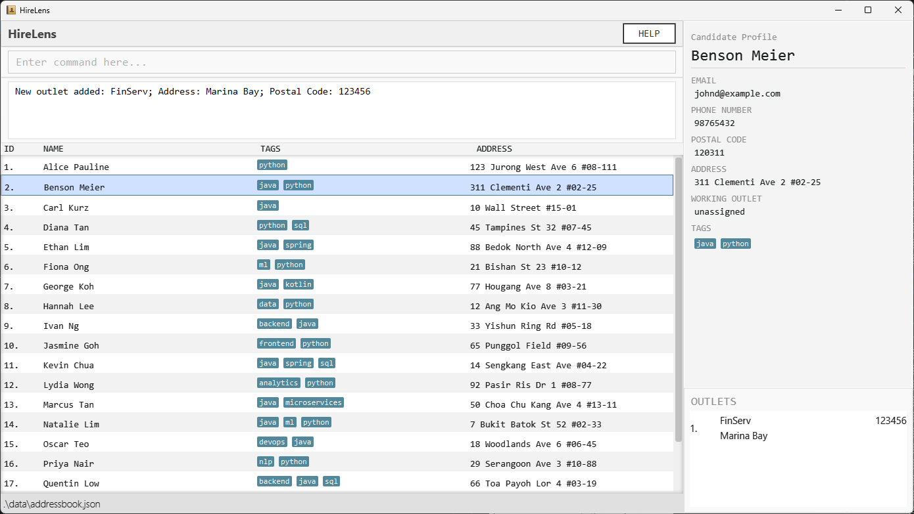
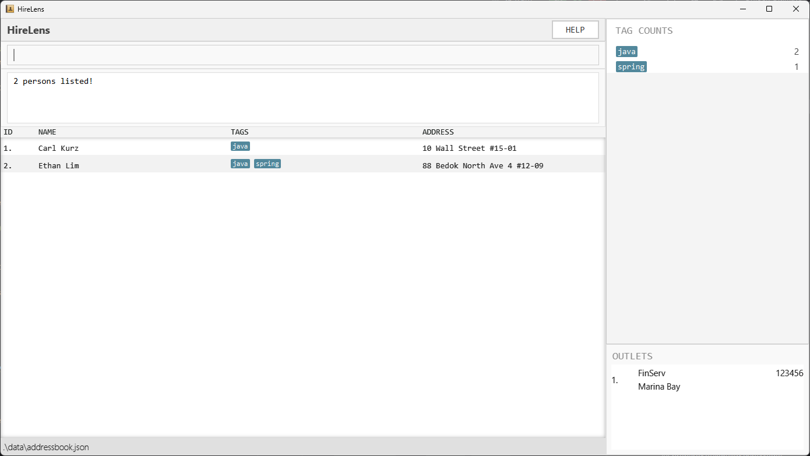
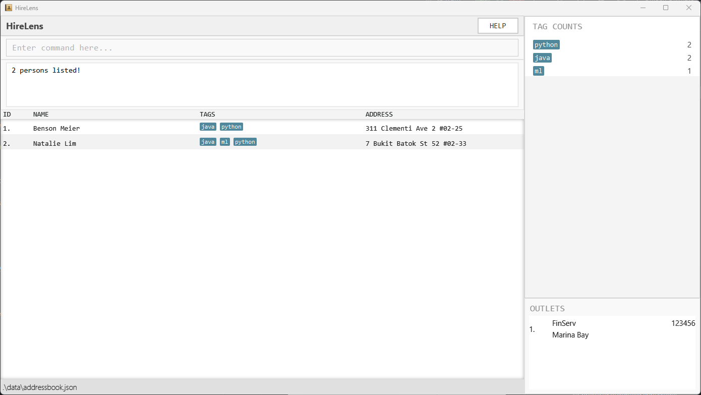

HireLens is a **desktop app for managing candidates, optimized for use via a Command Line Interface** (CLI) while still having the benefits of a Graphical User Interface (GUI). If you can type fast, HireLens can get your candidate management tasks done faster than traditional GUI apps.

* Table of Contents
  {:toc}

--------------------------------------------------------------------------------------------------------------------

## Quick start

1. Ensure you have Java `17` or above installed in your Computer. 
   **Mac users:** Ensure you have the precise JDK version prescribed [here](https://se-education.org/guides/tutorials/javaInstallationMac.html).

2. Download the latest `.jar` file from [here](https://github.com/se-edu/addressbook-level3/releases).

3. Copy the file to the folder you want to use as the _home folder_ for your AddressBook.

4. Open a command terminal, `cd` into the folder you put the jar file in, and use the `java -jar addressbook.jar` command to run the application. 
   A GUI similar to the below should appear in a few seconds. Note how the app contains some sample data. 
   

5. Type the command in the command box and press Enter to execute it. e.g. typing **`help`** and pressing Enter will open the help window. 
   Some example commands you can try:

    * `list` : Lists all contacts.

    * `add n/John Doe p/98765432 e/johnd@example.com a/John street, block 123, #01-01` : Adds a contact named `John Doe` to the Address Book.

    * `delete 3` : Deletes the 3rd contact shown in the current list.

    * `clear` : Deletes all contacts.

    * `exit` : Exits the app.

6. Refer to the [Features](#features) below for details of each command.

--------------------------------------------------------------------------------------------------------------------

## Features

**:information_source: Notes about the command format:** 

* Words in `UPPER_CASE` are the parameters to be supplied by the user. 
  e.g. in `add n/NAME`, `NAME` is a parameter which can be used as `add n/John Doe`.

* Items in square brackets are optional. 
  e.g `n/NAME [t/TAG]` can be used as `n/John Doe t/friend` or as `n/John Doe`.

* Items with `…`​ after them can be used multiple times including zero times. 
  e.g. `[t/TAG]…​` can be used as ` ` (i.e. 0 times), `t/friend`, `t/friend t/family` etc.

* Parameters can be in any order. 
  e.g. if the command specifies `n/NAME p/PHONE_NUMBER`, `p/PHONE_NUMBER n/NAME` is also acceptable.

* Extraneous parameters for commands that do not take in parameters (such as `help`, `list`, `exit` and `clear`) will be ignored. 
  e.g. if the command specifies `help 123`, it will be interpreted as `help`.

* If you are using a PDF version of this document, be careful when copying and pasting commands that span multiple lines as space characters surrounding line-breaks may be omitted when copied over to the application.

### Viewing help : `help`

Displays the user guide markdown file as raw, but readable markdown text.

Format: `help`

### Adding a person: `add`

Adds a person to the address book.

Format: `add n/NAME p/PHONE_NUMBER e/EMAIL a/ADDRESS pc/POSTAL_CODE [t/TAG]…​`

:bulb: **Tip:**
A person can have any number of tags (including 0)

Examples:
* `add n/John Doe p/98765432 e/johnd@example.com a/John street, block 123, #01-01 pc/123456`
* `add n/Betsy Crowe t/friend e/betsycrowe@example.com a/Newgate Prison p/1234567 pc/654321 t/criminal`

### Adding persons by csv file: `addcsv`

Format: `addcsv path/to/csv/from/root.csv`

### Listing all persons : `list`

Shows a list of all persons in the address book.

Format: `list`

### Editing a person : `edit`

Edits at least one existing person in the address book.

Format: `edit INDEXES [n/NAME] [p/PHONE] [e/EMAIL] [a/ADDRESS] [pc/POSTAL_CODE] [t/TAG]…​`

* Edits the people at the specified `INDEXES`. The index refers to the index number shown in the displayed person list. The index **must be a positive integer** 1, 2, 3, …​
* At least one index must be provided and all the indexes provided must be valid inputs.
* At least one of the optional fields must be provided.
* Existing values will be updated to the input values.
* When editing tags, the existing tags of the person will be removed i.e adding of tags is not cumulative.
* You can remove all the person’s tags by typing `t/` without
  specifying any tags after it.

Examples:
*  `edit 1 p/91234567 e/johndoe@example.com` Edits the phone number and email address of the 1st person to be `91234567` and `johndoe@example.com` respectively.
*  `edit 2 n/Betsy Crower t/` Edits the name of the 2nd person to be `Betsy Crower` and clears all existing tags.
*  `edit 1 2 3 t/python` Edits the tags of the 1st, 2nd and 3rd person to be replaced by python.

### Locating persons by name: `find`

Finds persons whose names contain any of the given keywords.

Format: `find KEYWORD [MORE_KEYWORDS]`

* The search is case-insensitive. e.g `hans` will match `Hans`
* The order of the keywords does not matter. e.g. `Hans Bo` will match `Bo Hans`
* Only the name is searched.
* Only full words will be matched e.g. `Han` will not match `Hans`
* Persons matching at least one keyword will be returned (i.e. `OR` search).
  e.g. `Hans Bo` will return `Hans Gruber`, `Bo Yang`
* The search works on the CURRENT view of the Address Book, rather than the full Address Book.

Examples:
* `find John` returns `john` and `John Doe`
* `find carl ethan` returns `Carl Kurz`, `Ethan Lim`  
  

### Locating persons by tag: `filter`

Finds persons who contains ALL of the given tags, and tags given in the tag combo.

Format: `filter t/TAG [t/TAG...] [tc/TAG_COMBO...]`

* The search is case-insensitive. e.g `hans` will match `Hans`.
* The search works on the CURRENT view of the AddressBook, rather than the full AddressBook.
* The search requires at least 1 tag/tag combo to work.
* The tag combo must exist to work, whereas an invalid tag will simply return 0 persons.

Examples:
* `filter tc/ml dev`
* `filter t/java tc/ml dev`
* `filter t/c` returns `Esther Lim`.
* `filter t/Java t/Python` returns `Benson Meier`, `Natalie Lim`.
* 

### Listing existing tags: `listtags`

Lists all tags in descending order, along with their frequencies.

* Order is not guaranteed in the case of ties.

Format: `listtags`

### Adding tag combos: `addtagcombo`

Adds a tag combo to the Address Book.

Format: `addtagcombo NAME t/TAG t/TAG [t/TAG]...`

* The name of the tag combo must consist of only alphanumeric characters, and be at most 25 characters long.
* Minimally 2 tags are needed to define a tag combo, as a tag combo with only one tag is functionally equivalent to a tag with an alias.

Examples:
* `addtagcombo ml dev t/python t/ml`
* `addtagcombo java backend dev t/java t/backend t/docker`

### Deleting tag combos: `deletetagcombo`

Deletes a tag combo from the Address Book.

Format: `deletetagcombo INDEX`

* Deletes the tag combo at the specified `INDEX`.
* The index refers to the index number shown in the displayed tag combo list.
* The index **must be a positive integer** 1, 2, 3, …​

Examples:
* `deletetagcombo 1`

### Listing tag combos: `listtagcombo`

Lists all tag combos in the right pane.

Format: `listtagcombo`

* 

### Deleting a person : `delete`

Deletes the specified person from the address book.

Format: `delete INDEX`

* Deletes the person at the specified `INDEX`.
* The index refers to the index number shown in the displayed person list.
* The index **must be a positive integer** 1, 2, 3, …​

Examples:
* `list` followed by `delete 2` deletes the 2nd person in the address book.
* `find Betsy` followed by `delete 1` deletes the 1st person in the results of the `find` command.

### Clearing all entries : `clear`

Clears all entries from the address book.

Format: `clear`

### Undoing previous action : `undo`

Reverts the previous action performed.
Note that the actions of a user are not saved when the app is closed. Thus, closing the app and attempting to
undo the last action performed will result in the message "Nothing to undo!".

Format: `undo`

* `add` Deletes the `Person` added.
* `addcsv` Deletes all `Person`s added.
* `outlet add` Deletes the `Outlet` added.
* `addtagcombo` Deletes the `tagcombo` added.
* `delete` Adds the `Person` deleted.
* `outlet delete` Adds the `Outlet` deleted.
* `deletetagcombo` Adds the `tagcombo` deleted.
* `edit` Returns the edited `Person` to original state.
* `outlet edit` Returns the edited `Outlet` to the original state.
* `outlet assign` Unassigns the `Person` from the given `Outlet`.
* `outlet unassign` Reassigns the `Person` to the previous `Outlet`.
* `list`, `filter`, `find` Returns to the previous view of the Address Book.
* `clear` Adds all `Person`s deleted.

### Comparing Candidates: `compare INDEX_1 INDEX_2`

Compare two candidates from the current list by displayed index, side-by-side in the right-hand-side display pane.
Information clears when another action takes up the right-hand-side pane.

Format: `compare INDEX_1 INDEX_2`

Example: `compare 1 12` selects candidate numbered 1 and 12 in the list for comparison

### Redoing previous action : `undo`

Redoes the previous action performed.
Note that after performing a new action, the previous undo cannot be redone. This is to prevent complicated interactions
that may arise from editing an entry and then redoing the previous edit.
To demonstrate:
- `edit 1 t/python`
- `undo`
- `edit 1 n/John Doe`
- `redo` -> "Nothing to redo!"

Format: `redo`

* `add` Adds the `Person` deleted.
* `addcsv` Adds all `Person`s deleted.
* `outlet add` Adds the `Outlet` deleted.
* `addtagcombo` Adds the `tagcombo` deleted.
* `delete` Deletes the `Person` added.
* `outlet delete` Deletes the `Outlet` added.
* `deletetagcombo` Deletes the `tagcombo` added.
* `edit` Returns the original `Person` to edited state.
* `outlet edit` Returns the original `Outlet` to the edited state.
* `outlet assign` Reassigns the `Person` to the given `Outlet`.
* `outlet unassign` Unassigns the `Person` from the previous `Outlet`.
* `list`, `filter`, `find` Returns to the filtered view of the Address Book.
* `clear` Deletes all `Person`s added.

### Exiting the program : `exit`

Exits the program.

Format: `exit`

### Adding Outlets : `outlet add`

Adds an `Outlet`.

Format: `outlet add n/<name> a/<address> pc/<postalCode>`

- Outlet name must be at most 26 characters long.
- Outlet address must be at most 35 characters long.
- Outlet name and address must not contain delimiters.

Examples:

- `outlet add n/FinServ a/Marina Bay pc/018956`
- `outlet add n/TechCo a/Raffles Place pc/048623`

### Editing Outlets : `outlet edit`

Edits an existing `Outlet`.

Format: `outlet edit <index> [n/<name>] [a/<address>] [pc/<postalCode>]`

Examples:

- `outlet edit 1 a/One Raffles Place pc/048616`
- `outlet edit 2 n/TechHub`

### Assigning Candidates to Outlets : `outlet assign`

Assigns a candidate to an `Outlet`.

Format: `outlet assign <candidateIndex> [outletIndex]`

- If `outletIndex` is omitted, the candidate is assigned to the nearest outlet by postal code.
- If candidate address appears to be outside Singapore, assignment still succeeds and a warning is shown.
- The outside-Singapore warning is heuristic (keyword-based) and may have false positives/negatives.

Examples:

- `outlet assign 2 1`
- `outlet assign 2`

### Unassigning Candidates from Outlets : `outlet unassign`

Unassigns a candidate from their working `Outlet`.

Format: `outlet unassign <candidateIndex>`

Examples:

- `outlet unassign 2`

### Deleting Outlets : `outlet delete`

Deletes an `Outlet`.

Format: `outlet delete <index>`

- If candidates are assigned to the deleted outlet, they are automatically unassigned.

Examples:

- `outlet delete 1`

### Listing Outlets : `outlet list`

Lists all outlets.

Format: `outlet list`

### Saving the data

AddressBook data are saved in the hard disk automatically after any command that changes the data. There is no need to save manually.

### Editing the data file

AddressBook data are saved automatically as a JSON file `[JAR file location]/data/addressbook.json`. Advanced users are welcome to update data directly by editing that data file.

:exclamation: **Caution:**
If your changes to the data file makes its format invalid, AddressBook will discard all data and start with an empty data file at the next run. Hence, it is recommended to take a backup of the file before editing it. 
Furthermore, certain edits can cause the AddressBook to behave in unexpected ways (e.g., if a value entered is outside of the acceptable range). Therefore, edit the data file only if you are confident that you can update it correctly.

### Archiving data files `[coming in v2.0]`

_Details coming soon ......_

--------------------------------------------------------------------------------------------------------------------

## FAQ

**Q**: How do I transfer my data to another Computer? 
**A**: Install the app in the other computer and overwrite the empty data file it creates with the file that contains the data of your previous AddressBook home folder.

--------------------------------------------------------------------------------------------------------------------

## Known issues

1. **When using multiple screens**, if you move the application to a secondary screen, and later switch to using only the primary screen, the GUI will open off-screen. The remedy is to delete the `preferences.json` file created by the application before running the application again.
2. **If you minimize the Help Window** and then run the `help` command (or use the `Help` menu, or the keyboard shortcut `F1`) again, the original Help Window will remain minimized, and no new Help Window will appear. The remedy is to manually restore the minimized Help Window.

--------------------------------------------------------------------------------------------------------------------

## Command summary

Action | Format, Examples
--------|------------------
**Add** | `add n/NAME p/PHONE_NUMBER e/EMAIL a/ADDRESS pc/POSTAL_CODE [t/TAG]…​`   e.g., `add n/James Ho p/22224444 e/jamesho@example.com a/123, Clementi Rd pc/123456 t/friend t/colleague`
**Clear** | `clear`
**Delete** | `delete INDEX`  e.g., `delete 3`
**Edit** | `edit INDEXES [n/NAME] [p/PHONE_NUMBER] [e/EMAIL] [a/ADDRESS] [pc/POSTAL_CODE] [t/TAG]…​`  e.g.,`edit 2 n/James Lee e/jameslee@example.com`
**Find** | `find KEYWORD [MORE_KEYWORDS]`  e.g., `find James Jake`
**Filter** | `filter t/TAG [t/TAG]... [tc/TAG_COMBO]... `  e.g., `filter t/java t/python tc/ml dev`
**List** | `list`
**Help** | `help`
**Undo** | `undo`
**Redo** | `redo`
**List Tags** | `listtags`
**Add Tag Combo** | `addtagcombo NAME t/TAG t/TAG [t/TAG]...`  e.g., `addtagcombo ml dev t/python t/ml`
**Delete Tag Combo** | `deletetagcombo INDEX`  e.g., `deletetagcombo 1`
**List Tag Combos** | `listtagcombo`
**Add by csv** | `addcsv`
**Add Outlet** | `outlet add n/<name> a/<address> pc/<postalCode>`   e.g., `outlet add n/FinServ a/Marina Bay pc/018956`
**Edit Outlet** | `outlet edit <index> [n/<name>] [a/<address>] [pc/<postalCode>]`   e.g., `outlet edit 1 a/One Raffles Place pc/048616`
**Assign Outlet** | `outlet assign <candidateIndex> [outletIndex]`   e.g., `outlet assign 2 1`
**Unassign Outlet** | `outlet unassign <candidateIndex>`   e.g., `outlet unassign 2`
**Delete Outlet** | `outlet delete <index>`   e.g., `outlet delete 1`
**Edit Outlet** | `outlet edit <index> [n/NAME] [a/ADDRESS] [pc/POSTAL_CODE]`   e.g., `outlet edit 1 n/Techco`
**List Outlets** | `outlet list`
